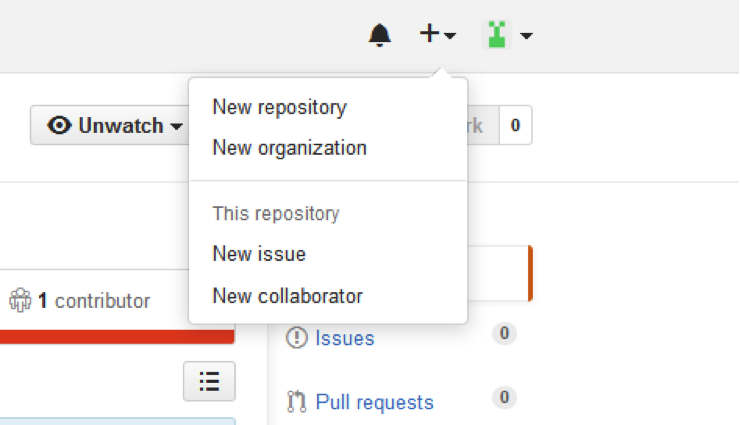
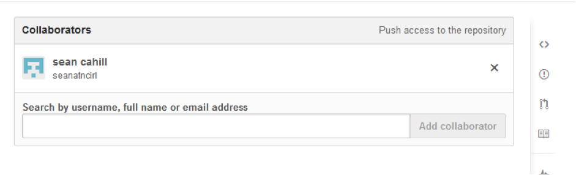
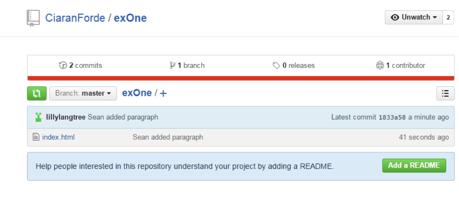

# Adding collaborators

The first step is to add a collaborator to you project in GitHub. We are going to buddy up for this session. Pair up with your nearest colleague or one of your mentors.

- In GitHub navigate to your project and click on the ‘+’ button in the top right.

- Select ‘New Collaborator’ and add your buddy as a collaborator. Add their github account to the collaborator input.

- Now that you have added a collaborator, ask your colleague to clone the project you have set up in previous challenge e.g. one of your  projects you’ve pushed to github. Giving them the repo url. (Check notes above for clone command)
- Give your colleague a short ‘spec’ of what you want to have changed in your project (it can be something small, adding a line of code).
- Your colleague should create a new folder to work on your project.
- Your colleague should make the change once they have cloned the project then add and commit changes and push to GitHub.
- Once they are done you will issue a pull request to see the changes they have made.
- Issue the command `git diff HEAD` and `git diff HEAD~1`
- You will then see the changes that have been made.
- Reverse this process so that you are now asked by your buddy to make a change.

> Note: When your colleague has committed you can view commits in GitHub

 
> Select the “commits” link in the top left 
